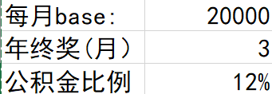
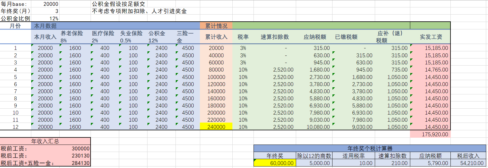
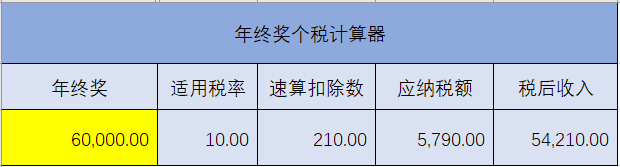
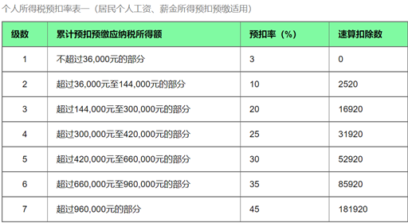

# Salary-Calculator
适用于2018年个税改革后的到手工资计算、五险一金、年终奖等。适合求职、在职的小伙伴食用

### 使用方式

1. **仅需要修改以下3项**

   

2. **假设**公积金缴纳**基数不超过上限**（以当地为准）
   - 月薪4万的土豪请自己手动更改excel
   - 不能足额交的，只能默默心疼你1s
3. 黄色高亮代表**税前工资**，粉色背景代表**到手工资**

### 主页 

### 副页（年终奖）！！！注意：不需要修改，已锁定编辑

### 备注：个税计算方式

